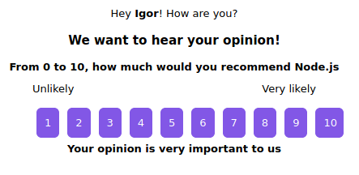

<!--
*** Thanks for checking out the Best-README-Template. If you have a suggestion
*** that would make this better, please fork the repo and create a pull request
*** or simply open an issue with the tag "enhancement".
*** Thanks again! Now go create something AMAZING! :D
***
***
***
*** To avoid retyping too much info. Do a search and replace for the following:
*** fell-lucas, nlw-moveit, twitter_handle, lucasafell@gmail.com, Move it, Move it is an application written during the event Next Level Week #4 by Rocketseat. This was a write-along project, and it is purely educational.
-->

<!-- PROJECT SHIELDS -->
<!--
*** I'm using markdown "reference style" links for readability.
*** Reference links are enclosed in brackets [ ] instead of parentheses ( ).
*** See the bottom of this document for the declaration of the reference variables
*** for contributors-url, forks-url, etc. This is an optional, concise syntax you may use.
*** https://www.markdownguide.org/basic-syntax/#reference-style-links
-->

[![Contributors][contributors-shield]][contributors-url]
[![Forks][forks-shield]][forks-url]
[![Stargazers][stars-shield]][stars-url]
[![Issues][issues-shield]][issues-url]
[![LinkedIn][linkedin-shield]][linkedin-url]

<!-- PROJECT LOGO -->
<br />
<p align="center">
  <a href="https://github.com/IgorDalepiane/NLW04_Nodejs">
    
  </a>

  <h3 align="center">NPS Calculator</h3>

  <p align="center">
    This application was developed during the Next Level Week # 04 provided by Rocketseat, from 02/22/2021 until 02/26/2021.
    <br />
    <br />
  </p>
</p>

<!-- TABLE OF CONTENTS -->
<details open="open">
  <summary><h2 style="display: inline-block">Table of Contents</h2></summary>
  <ol>
    <li>
      <a href="#about-the-project">About The Project</a>
      <ul>
        <li><a href="#built-with">Built With</a></li>
      </ul>
    </li>
    <li>
      <a href="#getting-started">Getting Started</a>
      <ul>
        <li><a href="#prerequisites">Prerequisites</a></li>
        <li><a href="#installation">Installation</a></li>
      </ul>
    </li>
    <li><a href="#usage">Usage</a></li>
    <li><a href="#contact">Contact</a></li>
    <li><a href="#acknowledgements">Acknowledgements</a></li>
  </ol>
</details>

<!-- ABOUT THE PROJECT -->

## About The Project

<p align="center">
  <a href="https://moveit-sooty.vercel.app">
    
  </a>
</p>

### Built With

-   [Node.js](https://nodejs.org)
-   [TypeScript](https://www.typescriptlang.org/)
-   [TypeORM](https://typeorm.io)

<!-- GETTING STARTED -->

## Getting Started

To get a local copy up and running follow these simple steps.

### Prerequisites

-   You must have Node.js installed on your machine.

### Installation

1. Clone the repo
    ```sh
    git clone https://github.com/IgorDalepiane/NLW04_Nodejs.git
    ```
2. Install NPM packages
    ```sh
    npm install
    ```
3. Run local server
    ```sh
    npm run dev
    ```

For more detailed installation steps, use this [link](https://www.notion.so/Configura-es-do-ambiente-Node-js-2d7216f5f1d641939dd48046d5c819f1) provided by Rocketseat to guide you

<!-- USAGE EXAMPLES -->

## Usage

This application is only the backend for creating surveys, and relating to existing users, and then sends an email asking the user what level of satisfaction with a particular survey, he can respond from 0 to 10, after this is done a calculation called NPS (Net Promoter Score), which separates votes into: Detractors (0- 6), Passives (7 - 8) and Promoters (9 - 10), after the separation a calculation is applied to obtain the result .

## Contact

Igor Dalepiane da Costa - [@igordalepiane](https://www.linkedin.com/in/igordalepiane/) - igordalepiane@gmail.com

Project Link: [https://github.com/IgorDalepiane/NLW04_Nodejs](https://github.com/IgorDalepiane/NLW04_Nodejs)

<!-- ACKNOWLEDGEMENTS -->

## Acknowledgements

-   [Rocketseat](https://rocketseat.com.br)
-   [Daniele Leão Evangelista](https://www.linkedin.com/in/daniele-le%C3%A3o-evangelista-5540ab25/)

<!-- MARKDOWN LINKS & IMAGES -->
<!-- https://www.markdownguide.org/basic-syntax/#reference-style-links -->

[contributors-shield]: https://img.shields.io/github/contributors/IgorDalepiane/NLW04_Nodejs.svg?style=for-the-badge
[contributors-url]: https://github.com/IgorDalepiane/NLW04_Nodejs/graphs/contributors
[forks-shield]: https://img.shields.io/github/forks/IgorDalepiane/NLW04_Nodejs.svg?style=for-the-badge
[forks-url]: https://github.com/IgorDalepiane/NLW04_Nodejs/network/members
[stars-shield]: https://img.shields.io/github/stars/IgorDalepiane/NLW04_Nodejs.svg?style=for-the-badge
[stars-url]: https://github.com/IgorDalepiane/NLW04_Nodejs/stargazers
[issues-shield]: https://img.shields.io/github/issues/IgorDalepiane/NLW04_Nodejs.svg?style=for-the-badge
[issues-url]: https://github.com/IgorDalepiane/NLW04_Nodejs/issues
[linkedin-shield]: https://img.shields.io/badge/-LinkedIn-black.svg?style=for-the-badge&logo=linkedin&colorB=555
[linkedin-url]: https://www.linkedin.com/in/igordalepiane/
[product-screenshot]: readme/screenshot.png
